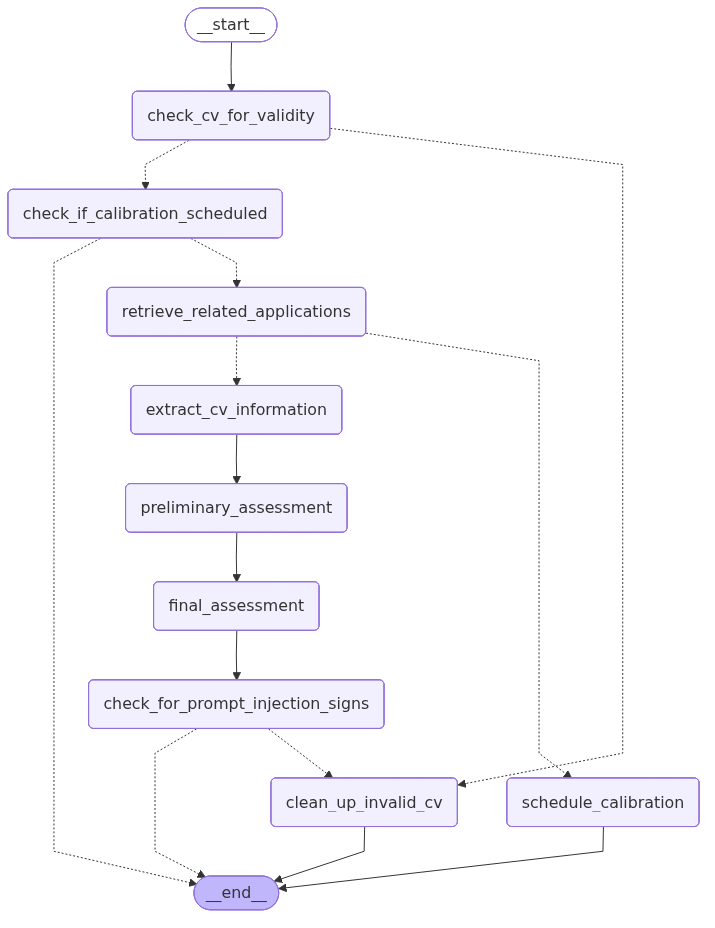

# Museum job applicant evaluation assistant
This tool demos a basic setup of an AI assistant for processing CVs of job
applicants. 

The key philosophy of the approach taken is to efficiently obtain expert human-in-the-loop information
on what makes applicants suitable for positions and then utilise this information to process large
numbers of applications. 
The system is self-improving over time as it gets more expert feedback.

> :warning: This project is in the early days of development and has not been thoroughly tested. Some
instructions may not work as expected.

## Features (and planned features)
At the moment the project consists of two main parts:
1. A backend data pipeline which incorporates an AI agent for processing CVs. It populates a database where an
indication of applicant suitability for positions is provided. As a precursor to this a vector database is
created during pre-processing to store descriptions of processed position descriptions. The code for processing is in `cv_pipeline/pipelines/process`, pre-processing is in `cv_pipeline/pipelines/preprocess`. The relevant agent is defined in `cv_pipelines/pipelines/agent` (the graph for the current version of this agent is displayed below). 

2. The ability to generate fake data for testing and demo purposes (see the section below for details on how
to run it).

The project is also planned to have:

3. A frontend AI agent for users to calibrate the AI system and manually approve its decisions. (This already exists but it just asks you about dinosaurs.)

4. An experimental loop. Check out a new branch, when ready this loop will allow you to commit some changes
and run `docker-compose run --env EXPERIMENT=True --build cv_process` to see how your changes impact results
and metrics (in the respective tables). This will also produce a mermaid diagram in the data/experiment_files
directory. [This is partially complete as a baseline version.]

5. A streamlit dashboard to view the results of experiments.

## Latest version of back end agent
This diagram illustrates the nodes and edges the agent state evolves through.

## Performance analysis
- The yet to be developed experimental loop will provide a way to assess performance.
- The right metric for this use case is recall. This is because we want to make sure we retrieve all
suitable applicants for further human review. We should also monitor precision because we may not want to
overwhelm the human reviewers with unsuitable applicants (subject to a decision about whether all rejections
should be subject to human review). 
- Must assess if there are differences in success rates for different protected attribute values of
applicants. This is necessary to ensure any bias can be found and appropriately handled.
- Should assess response times.
- Should also assess how well the system handles prompt injection. 
- Should determine cost estimates, since if we can get the same performance for lower cost, then we should do
that.

## Notes on the use case
- There are some potential issues around using notes on previous CVs to assess future CVs. Is it legally allowed to use summaries of previous CV suitability to inform future CV assessments? Are we embedding biases and setting ourselves up for a homogeneous team? This can be addressed in (at least) two ways as we build the system: (i) do a preliminary cv assessment without historical information in addition to one that uses historical information, and assess whether the latter is
actually an improvement over the former, and (ii) in our prompts be very careful to push the AI
system to use the notes as examples of "how to think" not "what to think". 

## Get the database running
Before doing anything else it's a good idea to get the db running and check you can access it in dbeaver or
similar. 

`docker-compose up postgres -d`

## To set up with fake data for demo purposes

1. Do `docker-compose up --build fake_data` to create data to be processed.
2. Do `docker-compose run --env SIMULATE_MANUAL_REVIEW=True fake_data` to create data to initialise without
having to do manual review. 

## Run the pipelines
1. To process data from source use `docker-compose run --build cv_preprocess`. This uploads the csv files
into the database, embeds descriptions of the positions descriptions and moves all the source data to the
raw folder. 

## Changes to the database tables
The tables are managed with Alembic. To change them:
1. Update `pipelines/get_data_models.py` with new definitions.
2. Locally run `uv run --env-file .env alembic revision --autogenerate -m "description of change"`
3. Do `docker-compose up --build db-migrator`.

## Tech notes
- The ollama image uses lots of memory. If you're using colima use `colima start --memory 24 --cpu 4`. 
- Position_number needs to be added to the metadata for positions in the vector store to reduce messy code. 
- Position description summaries need to be added to the positions table (as well as vectorstore) to reduce messy code.
